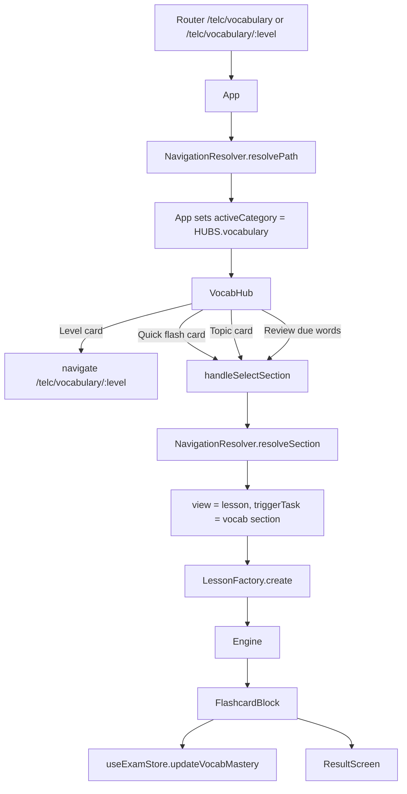

# Vocabulary System Documentation

## 1. Executive Summary

The vocabulary system is a single-page React flow built on the shared `App`, `Engine`, and `FlashcardBlock` architecture. There is no separate React Router route for the flashcard page itself. Vocabulary navigation stays inside the SPA and switches `App`'s internal `view` state to `lesson`, then renders `Engine`, which renders `FlashcardBlock`.

The main vocabulary entry points are:

1. Sidebar `Vocab Hub`
2. TELC level hub `Skill Building > Vocab Hub`
3. Full mock / free test first section, if the lesson includes vocabulary
4. `My Words`

The central vocabulary data is in:

```txt
src/data/vocabulary.js
```

The main components are:

```txt
src/components/ui/VocabHub.jsx
src/components/engine/FlashcardBlock.jsx
src/components/engine/Engine.jsx
src/utils/NavigationResolver.js
src/utils/LessonFactory.js
src/store/useExamStore.js
```

---

## 2. Current User Flows

### 2.1 Sidebar `Vocab Hub`

The sidebar is rendered by `AppShell`.

Button:

```jsx
<button onClick={() => handleNavItemClick(onNavigateToVocabHub)}>
  Vocab Hub
</button>
```

Passed from `App.jsx`:

```js
onNavigateToVocabHub={() => navigate('/telc/vocabulary')}
```

So the sidebar always opens:

```txt
/telc/vocabulary
```

That route shows the vocabulary level selector:

```txt
B1
B2
C1
```

Clicking one of those cards navigates to:

```txt
/telc/vocabulary/b1
/telc/vocabulary/b2
/telc/vocabulary/c1
```

---

### 2.2 TELC level hub `Skill Building > Vocab Hub`

The level hub is `BrandTestHub`.

`App.jsx` passes `EXTRA_TOOLS` into `BrandTestHub`. The vocabulary tool is:

```js
{
  id: 'vocab',
  title: 'Vocab Hub',
  description: 'Build lasting vocabulary with spaced-repetition. Essential for reading comprehension.',
  icon: <Library size={24} />,
  hubKey: 'vocabulary',
  color: '#8b5cf6'
}
```

When clicked, `BrandTestHub` calls:

```js
const levelToPass = ['vocabulary', 'drillshub'].includes(hubKey) ? level : null;
onSelectModule(hubKey, levelToPass);
```

`App.jsx` defines:

```js
const handleSelectModule = (hubKey, level = null) => {
  const basePath = `/telc/${hubKey.replaceAll('_', '-')}`;
  const path = level ? `${basePath}/${level.toLowerCase()}` : basePath;
  navigate(path);
};
```

So from `/telc/b1`, clicking Vocab Hub opens:

```txt
/telc/vocabulary/b1
```

From `/telc/b2`, it opens:

```txt
/telc/vocabulary/b2
```

From `/telc/c1`, it opens:

```txt
/telc/vocabulary/c1
```

---

### 2.3 Vocabulary Lab level page

A level-specific vocabulary page is rendered by `VocabHub` when `selectedLevel` is set.

Example:

```txt
/telc/vocabulary/b1
```

This renders:

```txt
VOCABULARY LAB — B1
```

The page has these actions:

1. `B1 Spaced-Repetition Flashcards`
2. Topic cards such as `Environment & Ecology`, `Sociology & Psychology`, etc.
3. Optional `Review Due Words` card, shown when there are due words

Clicking any vocabulary card starts a flashcard lesson immediately.

---

### 2.4 Flashcard page

The flashcard page is not a separate route. It is the internal `lesson` view.

Flow:

```txt
VocabHub card click
  ↓
handleSelectSection
  ↓
NavigationResolver.resolveSection
  ↓
view = 'lesson'
  ↓
handleStartTask
  ↓
LessonFactory.create
  ↓
Engine
  ↓
FlashcardBlock
```

The flashcard page displays:

1. Compact topic filter
2. Compact level filter
3. My Words link
4. Flashcard renderer
5. SRS controls:
   - Recall Failure
   - Uncertain
   - Mastered
6. Continue / Finish button
7. Optional next/previous section arrows if the lesson has multiple sections

The old full session configurator has been removed. VocabHub is now the launcher and owns the topic/level context by passing metadata into the flashcard task. `FlashcardBlock` only owns small local filters for VocabHub-origin vocabulary sessions.

Mock exam and free-test vocabulary sessions are locked: `Engine` passes `showFilters={false}` for those sessions, so filters and My Words are hidden and the test-provided vocabulary list is used unchanged.

---

### 2.5 Mock exam first screen vocabulary

Full mock lessons can start with a vocabulary section.

When the user clicks `Start Mock` in `BrandTestHub`, the app eventually calls:

```js
LessonFactory.prepareFullTest(testType, path)
```

Then:

```js
LessonFactory.createFullMockFromMock(mockData, type)
```

Full mock creation adds vocabulary first:

```js
if (mock.vocabulary) {
  sections.unshift({
    ...mock.vocabulary,
    ...mockMeta,
    skill: 'vocab',
    type: 'VOCAB'
  });
}
```

Then reading sections are added.

So the full mock lesson order is:

```txt
Vocabulary
Reading
Language Elements
Listening
Speaking
Writing
```

The vocabulary section is rendered by `Engine` as `FlashcardBlock` because:

```js
skill === 'vocab'
```

Important nuance: full mock vocabulary currently comes from `mock.vocabulary`, not dynamically from the reading passage at runtime. Some mock JSON files also include `vocabList` inside reading passages, but the full mock first section is the stored `mock.vocabulary` object.

Full mock vocabulary is treated as locked test vocabulary. It is rendered by `FlashcardBlock` with `showFilters={false}`, so the user cannot change topic or level inside the mock/test vocabulary section.

---

### 2.6 Free test vocabulary

Free-test lessons can also start with a vocabulary section.

The free-test vocabulary source is selected by `LessonFactory.create`:

1. `rawMock.vocabulary`, if present
2. Otherwise vocabulary found inside the reading exercise
3. Otherwise random vocabulary fallback

Free-test vocabulary is treated like mock vocabulary. It is rendered by `FlashcardBlock` with `showFilters={false}`, so the test-provided vocabulary list is locked and filters are hidden.

---

## 3. Routes

### 3.1 Vocabulary routes

Defined in:

```txt
src/Router.jsx
```

| URL | Router props | Internal view |
|---|---|---|
| `/telc/vocabulary` | `<App initialView="vocabulary" />` | Vocab level selector |
| `/telc/vocabulary/b1` | `<App initialView="vocabulary" initialLevel="b1" />` | Vocab Lab B1 |
| `/telc/vocabulary/b2` | `<App initialView="vocabulary" initialLevel="b2" />` | Vocab Lab B2 |
| `/telc/vocabulary/c1` | `<App initialView="vocabulary" initialLevel="c1" />` | Vocab Lab C1 |
| `/telc/mywords` | `<App initialView="mywords" />` | My Words |

---

### 3.2 TELC level hub routes

Defined in:

```txt
src/Router.jsx
```

| URL | Router props |
|---|---|
| `/telc/b1` | `<App initialView="telc-b1-hub" />` |
| `/telc/b2` | `<App initialView="telc-b2-hub" />` |
| `/telc/c1` | `<App initialView="telc-c1-hub" />` |

These render `BrandTestHub`.

---

### 3.3 Free test routes

Defined in:

```txt
src/Router.jsx
```

| URL | Router props |
|---|---|
| `/free-test/b1` | `<App initialView="telc-b1-free-test" />` |
| `/free-test/b2` | `<App initialView="telc-b2-free-test" />` |
| `/free-test/c1` | `<App initialView="telc-c1-free-test" />` |

These are public routes and start a mixed lesson flow that may include vocabulary first.

---

## 4. Data Model

### 4.1 `VOCAB_HUB`

`VOCAB_HUB` is topic-based.

Location:

```txt
src/data/vocabulary.js
```

Shape:

```js
{
  title: "Vocab Lab",
  description: "Master academic lexis using Spaced Repetition.",
  categories: [
    {
      id: "topic-environment",
      title: "Environment & Ecology",
      description: "...",
      tasks: [
        {
          id: "v_env_b1",
          type: "VOCAB",
          title: "B1",
          tier: "bronze",
          level: "B1",
          words: [
            {
              term: "Wildlife",
              hu: "Vadon élő állatok",
              definition: "Animals that live in nature.",
              example: "Wildlife is protected in parks."
            }
          ]
        }
      ]
    }
  ]
}
```

Each topic/category has level-specific tasks:

```txt
B1
B2
C1
```

Each task has a `words` array. Each word currently has:

```js
{
  term,
  hu,
  definition,
  example
}
```

Current topics:

```txt
Environment & Ecology
Sociology & Psychology
Business & Economics
Technology
Education
Health & Well-being
Science & Nature
Sports & Events
Physics & Time
Community & Facilities
Employment
History & Communication
General & Misc
```

---

### 4.2 `VOCAB_LEVELS`

`VOCAB_LEVELS` is level-based.

It is generated from `VOCAB_HUB` using:

```js
createLevelCategory(VOCAB_HUB.categories, 'B1')
createLevelCategory(VOCAB_HUB.categories, 'B2')
createLevelCategory(VOCAB_HUB.categories, 'C1')
```

Each level category contains:

1. A quick flash task:

```js
{
  id: "vocab_b1_quickflash",
  type: "VOCAB_FLASHCARDS",
  title: "Quick Flash - B1",
  tier: "gold",
  level: "B1",
  isRandomMix: true,
  isQuickFlash: true,
  xp: 150,
  words: levelWords
}
```

2. Topic tasks copied from `VOCAB_HUB`.

Important note: the current `App` route uses `HUBS.vocabulary`, which is currently `VOCAB_HUB`, not `VOCAB_LEVELS`. So the level-based structure exists, but the active route flow mostly uses the topic-based `VOCAB_HUB`.

---

## 5. Navigation Resolver

Defined in:

```txt
src/utils/NavigationResolver.js
```

### 5.1 `resolvePath`

Handles route-to-internal-view mapping.

For vocabulary:

```js
if (path === 'vocabulary' || path.startsWith('vocabulary/')) {
  const levelParam = path === 'vocabulary' ? null : path.split('/')[1];

  return {
    view: 'drillsHub',
    viewHistory: ['drillsHub'],
    activeCategory: HUBS.vocabulary,
    activeSection: null,
    triggerTask: null,
    triggerFullTest: null,
    context: { vocabLevel: levelParam ? levelParam.toUpperCase() : null }
  };
}
```

So:

```txt
/telc/vocabulary      -> activeCategory = HUBS.vocabulary, selectedLevel = null
/telc/vocabulary/b1   -> activeCategory = HUBS.vocabulary, selectedLevel = 'B1'
/telc/vocabulary/b2   -> activeCategory = HUBS.vocabulary, selectedLevel = 'B2'
/telc/vocabulary/c1   -> activeCategory = HUBS.vocabulary, selectedLevel = 'C1'
```

---

### 5.2 `resolveSection`

Used when a VocabHub card is clicked.

Important behavior:

```js
if (shouldStartTaskImmediately(section)) {
  return {
    view: 'lesson',
    viewHistory: ['lesson'],
    activeCategory: activeCategory,
    activeSection: null,
    triggerTask: section
  };
}
```

`shouldStartTaskImmediately` returns `true` for:

```js
section.type === 'VOCAB_FLASHCARDS'
```

So clicking a vocabulary flashcard card immediately starts the lesson.

---

## 6. Component Flow



---

## 7. Props Passed Through the Vocabulary Flow

### 7.1 `Router` to `App`

```jsx
<App initialView="vocabulary" initialLevel="b1" />
```

`initialLevel` is optional.

Examples:

```jsx
<App initialView="vocabulary" />
<App initialView="vocabulary" initialLevel="b1" />
<App initialView="vocabulary" initialLevel="b2" />
<App initialView="vocabulary" initialLevel="c1" />
```

---

### 7.2 `App` state derived from props

In `App.jsx`:

```js
const [selectedVocabLevel, setSelectedVocabLevel] = useState(
  initialLevel ? initialLevel.toUpperCase() : null
);
```

So:

```txt
initialLevel = 'b1' -> selectedVocabLevel = 'B1'
initialLevel = null -> selectedVocabLevel = null
```

---

### 7.3 `App` to `VocabHub`

Rendered in `App.jsx`:

```jsx
<VocabHub
  data={activeCategory}
  selectedLevel={selectedVocabLevel}
  onSelectSection={handleSelectSection}
  onNavigateToMyWords={handleNavigateToMyWords}
  onNavigateToLevelSelector={handleNavigateToLevelSelector}
  onNavigateToLevel={handleNavigateToLevel}
/>
```

Props:

| Prop | Value | Purpose |
|---|---|---|
| `data` | `HUBS.vocabulary` / `VOCAB_HUB` | Vocabulary source data |
| `selectedLevel` | `null`, `'B1'`, `'B2'`, or `'C1'` | Controls level selector vs level-specific view |
| `onSelectSection` | `handleSelectSection` | Starts vocab flashcard lesson |
| `onNavigateToMyWords` | `handleNavigateToMyWords` | Opens My Words |
| `onNavigateToLevelSelector` | `handleNavigateToLevelSelector` | Goes to `/telc/vocabulary` |
| `onNavigateToLevel` | `handleNavigateToLevel` | Goes to `/telc/vocabulary/:level` |

---

### 7.4 `VocabHub` click handlers

#### Level selector cards

When `selectedLevel === null`, VocabHub shows B1/B2/C1 cards.

Each card calls:

```js
onNavigateToLevel(level)
```

Which becomes:

```js
navigate(`/telc/vocabulary/${level.toLowerCase()}`)
```

#### Back to all levels

Calls:

```js
handleNavigateToLevelSelector()
```

Which navigates to:

```txt
/telc/vocabulary
```

#### My Words

Calls:

```js
handleNavigateToMyWords()
```

Which navigates internally to:

```txt
view = 'mywords'
```

#### Quick flash card

Calls:

```js
onSelectSection({
  ...quickFlashTask,
  type: 'VOCAB_FLASHCARDS',
  topic: 'All Topics',
  categoryTitle: 'All Topics',
  title: `${selectedLevel} Mixed Topics`,
  isRandomMix: true
})
```

This starts a mixed-topic session for the selected level. The flashcard page receives `topic: 'All Topics'` and `level: selectedLevel`, and its local `All Topics` filter resolves to all words for the currently selected level.

#### Topic card

Calls:

```js
onSelectSection({
  ...task,
  type: 'VOCAB_FLASHCARDS',
  topic: cat.title,
  categoryTitle: cat.title,
  title: cat.title
})
```

The extra `topic` and `categoryTitle` fields let `FlashcardBlock` initialize its compact topic filter to the topic that launched the session.

#### Review due words

Calls:

```js
onSelectSection({
  type: 'VOCAB_FLASHCARDS',
  words: dueWords.slice(0, 20),
  isRandomMix: true,
  title: 'Review Due Words',
  topic: 'Due Words',
  categoryTitle: 'Due Words',
  level: selectedLevel
})
```

Due words are treated as a locked source. The flashcard page uses the passed `words` array and does not resolve words from `VOCAB_HUB` by topic/level.

---

### 7.5 `App` to `LessonFactory`

`handleSelectSection` calls:

```js
const plan = resolveSection(section, activeCategory);
```

Then:

```js
handleStartTask(plan.triggerTask);
```

Then:

```js
const lesson = LessonFactory.create(taskMetadata);
```

For vocabulary:

```js
if (taskMetadata.type === 'VOCAB' || taskMetadata.type === 'VOCAB_FLASHCARDS') {
  return {
    ...taskMetadata,
    questions: taskMetadata.questions || taskMetadata.vocabList || taskMetadata.words || []
  };
}
```

So every vocab task becomes a lesson object with a `questions` array equal to its `words`.

---

### 7.6 `App` to `Engine`

Rendered in `App.jsx`:

```jsx
<Engine 
  activeLesson={activeLesson}
  activeSectionIndex={activeSectionIndex}
  activePassageIndex={activePassageIndex}
  userAnswers={userAnswers}
  onUpdateAnswers={handleUpdateAnswer}
  onCheckAnswers={handleCheckAnswers}
  isReviewMode={isReviewMode}
  availableSections={activeLesson?.sections || []}
  activeSkillTab={activeSkillTab}
  setActiveSectionIndex={setActiveSectionIndex}
  setActivePassageIndex={setActivePassageIndex}
  setIsReviewMode={setIsReviewMode}
  setActiveSkillTab={setActiveSkillTab}
  availableSkills={activeLesson?.sections?.map(s => s.skill).filter(Boolean) || []}
  onNavigateToMyWords={() => navigateToView('mywords')}
/>
```

---

### 7.7 `Engine` to `FlashcardBlock`

Defined in:

```txt
src/components/engine/Engine.jsx
```

The Engine detects vocabulary with:

```js
if (
  lessonType === 'VOCAB' ||
  lessonType === 'VOCAB_FLASHCARDS' ||
  (lessonType === 'free-test-flow' && skill === 'vocab') ||
  skill === 'vocab' ||
  isFullMockVocab
) {
  const vocabData = currentSection.vocabList
    ? { ...currentSection, questions: currentSection.vocabList }
    : currentSection;

  return (
    <FlashcardBlock 
      data={vocabData} 
      onComplete={onCheckAnswers}
      onNavigateToMyWords={onNavigateToMyWords}
      sections={availableSections}
      activeSkillTab={activeSkillTab}
      activeSectionIndex={activeSectionIndex}
      setActiveSectionIndex={setActiveSectionIndex}
      setActivePassageIndex={setActivePassageIndex}
      setIsReviewMode={setIsReviewMode}
      setActiveSkillTab={setActiveSkillTab}
      availableSkills={availableSkills}
      allSections={availableSections}
    />
  );
}
```

---

### 7.8 `FlashcardBlock` props

Defined in:

```txt
src/components/engine/FlashcardBlock.jsx
```

```js
const FlashcardBlock = ({ 
  data, 
  showFilters = true,
  onComplete,
  onNavigateToMyWords,
  sections = [],
  activeSectionIndex = 0,
  setActiveSectionIndex,
  setActivePassageIndex,
  setIsReviewMode,
  setActiveSkillTab,
  availableSkills = [],
}) => {
```

| Prop | Purpose |
|---|---|
| `data` | Current vocabulary lesson / flashcard data |
| `showFilters` | Controls compact topic + level filters and My Words link; `false` for locked mock/free-test vocabulary |
| `onComplete` | Usually `handleCheckAnswers`; continues to results |
| `onNavigateToMyWords` | Opens My Words |
| `sections` | Available lesson sections for next/previous arrows |
| `activeSectionIndex` | Current section index |
| `setActiveSectionIndex` | Updates current section |
| `setActivePassageIndex` | Resets passage index when moving sections |
| `setIsReviewMode` | Exits review mode |
| `setActiveSkillTab` | Updates skill tab |
| `availableSkills` | Skills available in the current lesson |

---

### 7.9 `FlashcardBlock` local filters

The full `SessionConfigForm` has been removed.

For VocabHub-origin vocabulary sessions, `FlashcardBlock` renders compact filters near the top of the flashcard UI:

- Topic filter
- Level filter
- My Words link

When `showFilters` is `false`, such as full mock or free-test vocabulary, the compact filters and My Words link are hidden.

Filter behavior:

| Filter value | Behavior |
|---|---|
| Specific topic + level | Uses `getWordsForSelection(topic, level)` |
| `All Topics` + level | Uses `getAllWordsForLevel(level)` |
| `Due Words` | Uses the `words` array passed from `VocabHub` |
| Locked mock/free-test | Uses `data.words` / `data.questions` and ignores filters |

---

## 8. Flashcard Behavior

### 8.1 Initial state

```js
const initialWords = useMemo(() => data?.words || data?.questions || [], [data?.words, data?.questions]);
const initialTopic = data?.topic || data?.categoryTitle || 'All Topics';
const initialLevel = data?.level || 'B1';

const [selectedLevel, setSelectedLevel] = useState(initialLevel);
const [selectedTopic, setSelectedTopic] = useState(initialTopic);
```

Meaning:

| Situation | Initial behavior |
|---|---|
| `data.words` or `data.questions` exists | Use those words as the source for locked sessions or due-word sessions |
| `showFilters` is `true` | Show compact topic + level filters |
| `showFilters` is `false` | Hide filters and use the passed vocabulary list unchanged |
| `data.topic` or `data.categoryTitle` exists | Use that as the initial topic filter |
| `data.topic` missing | Default to `All Topics` |
| `data.level` exists | Use that as the initial level filter |
| `data.level` missing | Default to `B1` |

---

### 8.2 Word source

`FlashcardBlock` resolves words according to the session source.

For locked mock/free-test vocabulary and due-word sessions, it uses the passed vocabulary array:

```js
initialWords = data?.words || data?.questions || []
```

For unlocked VocabHub-origin sessions, it uses the local topic and level filters.

Specific topic lookup:

```js
const getWordsForSelection = (topic, level) => {
  if (topic === 'All Topics' || topic === 'Due Words') return [];

  const category = VOCAB_HUB.categories.find(cat => cat.title === topic);
  if (!category) return [];
  
  const task = category.tasks.find(t => t.level === level);
  if (!task) return [];
  
  return task.words || [];
};
```

`All Topics` lookup:

```js
const getAllWordsForLevel = (level) => {
  return VOCAB_HUB.categories.flatMap(category => {
    const task = (category.tasks || []).find(t => t.level === level);
    return task?.words || [];
  });
};
```

Source selection:

```js
const shouldUseInitialWords = !showFilters || selectedTopic === 'Due Words';

const sourceWords = shouldUseInitialWords
  ? initialWords
  : selectedTopic === 'All Topics'
    ? getAllWordsForLevel(selectedLevel)
    : getWordsForSelection(selectedTopic, selectedLevel);
```

Behavior:

| Session type | Topic filter | Level filter | Word source |
|---|---|---|---|
| VocabHub topic card | Specific topic | Selected level | `getWordsForSelection(topic, level)` |
| VocabHub quick flash | `All Topics` | Selected level | `getAllWordsForLevel(level)` |
| VocabHub due words | `Due Words` | Selected level | Passed due-word array |
| Full mock vocabulary | Hidden | Hidden | Passed mock vocabulary array |
| Free-test vocabulary | Hidden | Hidden | Passed free-test vocabulary array |

---

### 8.3 SRS ordering

Before display, words are sorted by review priority:

```js
prioritizeWords(sourceWords, vocabProgress)
```

Rules:

1. Due words first
2. Lower mastery level first
3. Earlier review date first

If the task has `isRandomMix`, the prioritized words are shuffled.

---

### 8.4 Mastery update

Buttons call:

```js
handleDifficulty('hard')
handleDifficulty('good')
handleDifficulty('easy')
```

Which calls:

```js
updateVocabMastery(currentWord.term, level)
```

The mastery state is stored in `useExamStore`.

---

## 9. SRS Store

Defined in:

```txt
src/store/useExamStore.js
```

State:

```js
vocabProgress: {}
```

Shape:

```js
{
  "Sustainability": {
    level: 3,
    nextReview: 123456789
  }
}
```

`updateVocabMastery(term, difficulty)` updates:

```js
vocabProgress[term] = {
  level,
  nextReview
}
```

Current simplified behavior:

| Button | Difficulty | Effect |
|---|---|---|
| Recall Failure | `hard` | Level decreases by 1 |
| Uncertain | `good` | Level increases by 1 |
| Mastered | `easy` | Level becomes at least 3 |

Review intervals:

```js
[0, 1, 3, 7, 14, 30]
```

In test mode, seconds are used instead of days.

---

## 10. My Words

Route:

```txt
/telc/mywords
```

Rendered in `App.jsx`:

```jsx
<MyWords onBack={handleBackFromMyWords} />
```

`MyWords.jsx` reads all words from:

```js
VOCAB_HUB.categories
```

It uses `vocabProgress` to show mastered / due words.

---

## 11. Mock Exam Vocabulary Flow

There are two vocabulary flows connected to mocks.

---

### 11.1 Full mock flow

When the user clicks `Start Mock` in `BrandTestHub`, the route eventually calls:

```js
LessonFactory.prepareFullTest(testType, path)
```

Then:

```js
LessonFactory.createFullMockFromMock(mockData, type)
```

Full mock creation adds vocabulary first:

```js
if (mock.vocabulary) {
  sections.unshift({
    ...mock.vocabulary,
    ...mockMeta,
    skill: 'vocab',
    type: 'VOCAB'
  });
}
```

Then reading sections are added.

So the full mock lesson order is:

```txt
Vocabulary
Reading
Language Elements
Listening
Speaking
Writing
```

The vocabulary section is rendered by `Engine` as `FlashcardBlock` because:

```js
skill === 'vocab'
```

Important nuance: full mock vocabulary currently comes from `mock.vocabulary`, not dynamically from the reading passage at runtime. Some mock JSON files also include `vocabList` inside reading passages, but the full mock first section is the stored `mock.vocabulary` object.

---

### 11.2 Free test flow

Free test routes use:

```txt
/free-test/b1
/free-test/b2
/free-test/c1
```

The resolver triggers:

```js
triggerTask: {
  id: 'telc-b2-free-test',
  skill: 'free-test',
  level: 'b2'
}
```

`LessonFactory.create` handles `free-test` by creating a mixed lesson.

It tries to build vocabulary like this:

```js
const rawMock = pluckRandomFullMock(type);
const readingExercise = pluckRandom('reading', type);

let vocabExercise = rawMock?.vocabulary
  ? { ...rawMock.vocabulary, skill: 'vocab', type: 'VOCAB' }
  : null;

if (!vocabExercise) {
  vocabExercise = findVocabFromReading(readingExercise, rawMock?.vocabulary?.words);
}
```

So the free test vocabulary comes from:

1. `rawMock.vocabulary`, if present
2. Otherwise `findVocabFromReading`
3. Otherwise random vocabulary fallback

`findVocabFromReading` can extract vocabulary from:

```txt
readingExercise.vocabList
readingExercise.vocabId
readingExercise.sections[].passages[].vocabList
readingExercise.sections[].passages[].vocabId
readingExercise.passages[].vocabList
readingExercise.passages[].vocabId
```

If no vocabulary is found, it falls back to random vocabulary.

---

## 12. Current UI Route Mapping

### 12.1 Sidebar `Vocab Hub`

The sidebar is rendered by `AppShell`.

Button:

```jsx
<button onClick={() => handleNavItemClick(onNavigateToVocabHub)}>
  Vocab Hub
</button>
```

Passed from `App.jsx`:

```js
onNavigateToVocabHub={() => navigate('/telc/vocabulary')}
```

So sidebar always opens:

```txt
/telc/vocabulary
```

That page shows the level selector.

---

### 12.2 Level hub `Skill Building > Vocab Hub`

`BrandTestHub` receives `EXTRA_TOOLS` from `App.jsx`.

One item is:

```js
{
  id: 'vocab',
  title: 'Vocab Hub',
  description: 'Build lasting vocabulary with spaced-repetition. Essential for reading comprehension.',
  icon: <Library size={24} />,
  hubKey: 'vocabulary',
  color: '#8b5cf6'
}
```

When clicked:

```js
const levelToPass = ['vocabulary', 'drillshub'].includes(hubKey) ? level : null;
onSelectModule(hubKey, levelToPass);
```

`App.jsx` defines:

```js
const handleSelectModule = (hubKey, level = null) => {
  const basePath = `/telc/${hubKey.replaceAll('_', '-')}`;
  const path = level ? `${basePath}/${level.toLowerCase()}` : basePath;
  navigate(path);
};
```

So from `/telc/b1`, clicking Vocab Hub opens:

```txt
/telc/vocabulary/b1
```

From `/telc/b2`, it opens:

```txt
/telc/vocabulary/b2
```

From `/telc/c1`, it opens:

```txt
/telc/vocabulary/c1
```

---

## 13. Current Quirks and Risks

### 13.1 `VOCAB_LEVELS` exists but is not the main active hub

`VOCAB_LEVELS` is exported and used in `EXAM_CONFIG.extra.modules.vocabulary`, but `HUBS.vocabulary` is currently:

```js
vocabulary: VOCAB_HUB
```

So the active route flow uses `VOCAB_HUB`, not `VOCAB_LEVELS`.

---

### 13.2 Topic cards now pass topic metadata to `FlashcardBlock`

In `VocabHub.jsx`, topic cards now pass:

```js
onSelectSection({
  ...task,
  type: 'VOCAB_FLASHCARDS',
  topic: cat.title,
  categoryTitle: cat.title,
  title: cat.title
})
```

This lets `FlashcardBlock` initialize its compact topic filter correctly when a topic card launches the flashcard session.

Quick flash also passes:

```js
topic: 'All Topics',
categoryTitle: 'All Topics',
title: `${selectedLevel} Mixed Topics`,
isRandomMix: true
```

Due words pass:

```js
topic: 'Due Words',
categoryTitle: 'Due Words',
level: selectedLevel
```

---

### 13.3 Flashcard configurator has been removed

The full session configurator is no longer used.

For VocabHub-origin vocabulary, `FlashcardBlock` exposes only compact topic and level filters. The filters change the current word source dynamically:

- specific topic + level = that topic at that level
- `All Topics` + level = all topics at that level
- `Due Words` = passed due-word array

For mock-origin and free-test-origin vocabulary, filters are hidden and the passed test vocabulary list is locked.

---

### 13.4 SRS is keyed only by word term

The store uses:

```js
vocabProgress[term]
```

So the same word appearing in different topics or levels shares one progress record.

---

### 13.5 `VOCAB` and `VOCAB_FLASHCARDS` both render `FlashcardBlock`

The Engine treats these as equivalent for rendering:

```js
lessonType === 'VOCAB'
lessonType === 'VOCAB_FLASHCARDS'
```

The difference is mostly how they are started:

| Type | Typical source | Starts immediately? |
|---|---|---|
| `VOCAB_FLASHCARDS` | VocabHub topic/quick flash | Yes |
| `VOCAB` | Mock vocabulary, random vocabulary | Usually yes if it is a lesson section |

---

## 14. Current Simplified Model

The vocabulary flow is simplified around a launcher/renderer split.

`VocabHub` owns the vocabulary launch context:

- Level selector
- Level hub cards
- Topic cards
- Quick flash card
- Due words card
- My Words link
- Topic metadata passed to flashcard sessions

`FlashcardBlock` owns the lightweight flashcard session:

- Render flashcards
- Apply SRS ordering
- Update vocabulary mastery
- Show compact topic + level filters for unlocked VocabHub-origin sessions
- Hide filters for locked mock/free-test vocabulary

Current session shapes:

### Topic session

```js
{
  type: 'VOCAB_FLASHCARDS',
  level: 'B1',
  topic: 'Environment & Ecology',
  categoryTitle: 'Environment & Ecology',
  title: 'Environment & Ecology',
  words: [...]
}
```

### Mixed level session

```js
{
  type: 'VOCAB_FLASHCARDS',
  level: 'B1',
  topic: 'All Topics',
  categoryTitle: 'All Topics',
  title: 'B1 Mixed Topics',
  words: [...],
  isRandomMix: true
}
```

### Due words session

```js
{
  type: 'VOCAB_FLASHCARDS',
  level: 'B1',
  topic: 'Due Words',
  categoryTitle: 'Due Words',
  title: 'Review Due Words',
  words: [...],
  isRandomMix: true
}
```

### Mock/free-test vocabulary session

```js
{
  type: 'VOCAB',
  skill: 'vocab',
  title: 'Test Vocabulary',
  words: [...],
  sourceId: 'telc-b2-mock-1'
}
```

Current behavior:

| Mode | Filters shown | Word source |
|---|---|---|
| Topic | Topic + level | `getWordsForSelection(topic, level)` |
| Mixed / `All Topics` | Topic + level | `getAllWordsForLevel(level)` |
| Due words | Topic + level | Passed due-word array |
| Full mock vocabulary | Hidden | Passed mock vocabulary array |
| Free-test vocabulary | Hidden | Passed free-test vocabulary array |

---

## 15. File Map

```txt
src/Router.jsx
  Defines public URL routes.

src/App.jsx
  Owns internal SPA navigation state.
  Connects routes, hubs, lessons, and vocabulary.

src/data/index.js
  Defines HUBS.
  HUBS.vocabulary currently points to VOCAB_HUB.

src/data/vocabulary.js
  Defines VOCAB_HUB, VOCAB_LEVELS, and VOCAB_LESSONS.

src/utils/NavigationResolver.js
  Converts routes and section clicks into App plans.

src/utils/LessonFactory.js
  Converts vocabulary task metadata into lesson objects.

src/components/ui/VocabHub.jsx
  Renders level selector, level-specific Vocab Lab, quick flash, topic cards, due words.
  Passes topic/categoryTitle metadata into flashcard sessions.

src/components/engine/Engine.jsx
  Routes vocabulary lessons to FlashcardBlock.
  Detects locked mock/free-test vocabulary and passes showFilters={false}.

src/components/engine/FlashcardBlock.jsx
  Renders flashcards and compact topic/level filters for unlocked VocabHub-origin sessions.
  Uses getAllWordsForLevel(level) for All Topics behavior.
  Uses passed words unchanged for locked mock/free-test vocabulary and due words.

src/store/useExamStore.js
  Stores vocabulary SRS progress.

src/components/ui/MyWords.jsx
  Shows saved vocabulary progress.
```
